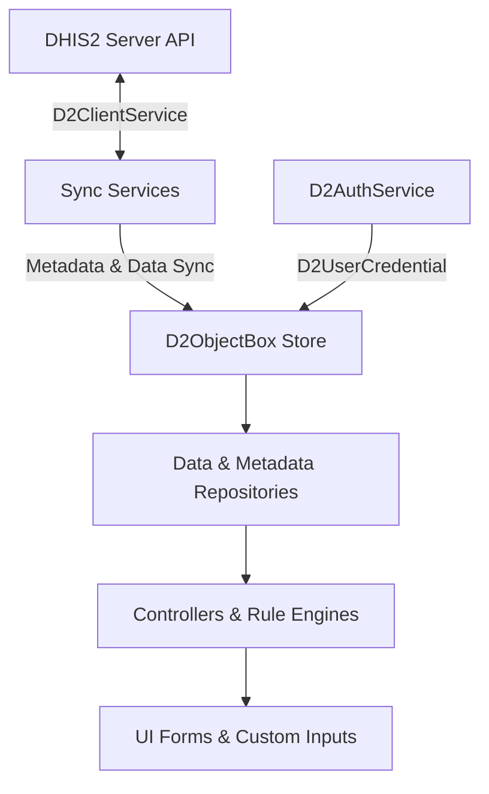

# DHIS2 Flutter Toolkit

A comprehensive, offline-first Flutter toolkit for building robust mobile and web applications that integrate seamlessly with [DHIS2](https://dhis2.org/). 

The toolkit provides high-level abstractions for **User Authentication**, **Offline Storage (ObjectBox)**, **Metadata & Tracker Data Synchronization**, **Dynamic Form Generation with Auto-Save**, **Program & Validation Rule Engines**, **Period Generation**, **Modular UI Components**, and **In-App Auto-Updates**.

---

## Table of Contents

- [Features](#features)
- [Architecture Overview](#architecture-overview)
- [Installation](#installation)
  - [1. Add Dependency](#1-add-dependency)
  - [2. Platform Configuration (Android)](#2-platform-configuration-android)
- [Getting Started](#getting-started)
  - [Step 1: Authentication](#step-1-authentication)
  - [Step 2: Database Initialization](#step-2-database-initialization)
  - [Step 3: Synchronizing Metadata & Data](#step-3-synchronizing-metadata--data)
    - [Option A: All-in-One Metadata Sync](#option-a-all-in-one-metadata-sync)
    - [Option B: Selective Metadata Sync by Type](#option-b-selective-metadata-sync-by-type)
      - [1. Program Metadata & Automatic Cascade](#1-program-metadata--automatic-cascade)
      - [2. Data Set Metadata & Validation Rules](#2-data-set-metadata--validation-rules)
      - [3. DataStore Synchronization & Offline Access](#3-datastore-synchronization--offline-access)
      - [4. Foundation & Org Unit Metadata](#4-foundation--org-unit-metadata)
    - [Monitoring Progress with D2SyncStatus](#monitoring-progress-with-d2syncstatus)
    - [Tracker Data Sync (Download & Upload)](#tracker-data-sync-download--upload)
  - [Step 4: Querying Data with Repositories](#step-4-querying-data-with-repositories)
- [UI Components Guide](#ui-components-guide)
  - [Tracker Registration Form](#tracker-registration-form)
  - [Tracker Event Form](#tracker-event-form)
  - [Standalone Input Field Container](#standalone-input-field-container)
  - [Period Selector Widget](#period-selector-widget)
  - [App Modals & Action Sheets](#app-modals--action-sheets)
  - [Custom Buttons](#custom-buttons)
- [Engines & Utilities](#engines--utilities)
  - [Program Rule Engine](#program-rule-engine)
  - [Validation Rule Engine](#validation-rule-engine)
  - [Period Engine & Utility](#period-engine--utility)
  - [UID Generator](#uid-generator)
  - [In-App Auto-Update Service](#in-app-auto-update-service)
- [Development & Contributing](#development--contributing)
  - [Prerequisites](#prerequisites)
  - [Setup & Code Generation](#setup--code-generation)
  - [Running Tests & Linting](#running-tests--linting)
  - [Contribution Guidelines](#contribution-guidelines)
- [License](#license)

---

## Features

- 🔐 **Authentication & Multi-Account Management**: Online and offline login verification with secure credential caching via `flutter_secure_storage`.
- 💾 **High-Performance Offline Database**: Backed by [ObjectBox](https://objectbox.io/) for fast, indexed queries and multi-tenant database isolation.
- 🔄 **Metadata & Tracker Synchronization**: Declarative background/foreground sync streams for Programs, Program Stages, Org Units, Tracked Entities, Enrollments, Events, and Data Value Sets.
- 📝 **Dynamic UI Forms**: Built-in support for DHIS2 Tracker Registration and Single-Event forms with section collapsible layouts, field-level validation, and auto-save capabilities.
- 🧩 **Comprehensive Form Inputs**: Ready-to-use inputs for Text, Numbers, Dates, Date Ranges, Coordinates with interactive OpenStreetMap views, Org Unit tree picker, Age picker, Barcode/QR scanning, Multi-select, and Radio/Select options.
- ⚡ **Rule Evaluation Engines**:
  - **Program Rule Engine**: Real-time evaluation of actions (`HIDEFIELD`, `ASSIGN`, `SHOWERROR`, `SHOWWARNING`, `MANDATORY`, `HIDEOPTION`, `HIDESECTION`).
  - **Validation Rule Engine**: Evaluation of aggregate validation rules with missing-value strategies and compulsory/exclusive pair checks.
- 📅 **DHIS2 Period Engine**: Full generation and parsing of DHIS2 Fixed periods (Daily, Weekly, Monthly, Yearly, Financial, etc.), Relative periods, and custom Date Ranges.
- 🚀 **GitHub In-App Auto Updates**: Check releases, stream APK downloads, and trigger native package installations directly from GitHub.

---

## Architecture Overview



---

## Installation

### 1. Add Dependency

Add `dhis2_flutter_toolkit` to your `pubspec.yaml`:

```yaml
dependencies:
  flutter:
    sdk: flutter
  dhis2_flutter_toolkit:
    # Use Git, Path, or pub.dev dependency
    git:
      url: https://github.com/hisptz/dhis2-flutter-toolkit.git
```

Run:
```bash
flutter pub get
```

### 2. Platform Configuration (Android)

If you plan to use camera features (Barcode Scanner), location (Coordinate inputs), or the in-app APK auto-updater on Android:

#### Permissions (`android/app/src/main/AndroidManifest.xml`)

Add the required permissions inside `<manifest>`:

```xml
<uses-permission android:name="android.permission.INTERNET" />
<uses-permission android:name="android.permission.ACCESS_FINE_LOCATION" />
<uses-permission android:name="android.permission.ACCESS_COARSE_LOCATION" />
<uses-permission android:name="android.permission.CAMERA" />
<!-- Required if using Auto-Update -->
<uses-permission android:name="android.permission.REQUEST_INSTALL_PACKAGES" />
```

#### Gradle Flags (`android/gradle.properties`)

```properties
android.useAndroidX=true
android.enableJetifier=true
```

For complete auto-update setup including `FileProvider` and Kotlin `MainActivity` MethodChannel, refer to the [Auto-Update Setup Guide](docs/auto_update_setup.md).

---

## Getting Started

### Step 1: Authentication

`D2AuthService` manages DHIS2 user sessions, secure offline storage of credentials, and switching between users:

```dart
import 'package:dhis2_flutter_toolkit/dhis2_flutter_toolkit.dart';

final authService = D2AuthService();

// Log in online or verify offline if network is unavailable
try {
  final D2UserCredential credential = await authService.login(
    baseURL: 'play.dhis2.org/40.0.0',
    username: 'admin',
    password: 'district',
    offlineFirst: false, // Set to true for offline-first verification
  );
  print('Logged in successfully: ${credential.username}');
} catch (e) {
  print('Login failed: $e');
}

// Fetch currently authenticated user credentials
final D2UserCredential? currentUser = await authService.currentUser();

// Logout
// await authService.logoutUser(deleteData: false);
```

### Step 2: Database Initialization

Each user has an isolated ObjectBox database store identified by user credentials:

```dart
import 'package:dhis2_flutter_toolkit/dhis2_flutter_toolkit.dart';

// Initialize ObjectBox store for the logged-in user
final D2ObjectBox db = await D2ObjectBox.create(currentUser!);
```

> **Tip for Unit Testing**: Use `await D2ObjectBox.createTest()` for in-memory databases during tests.

### Step 3: Synchronizing Metadata & Data

In DHIS2, metadata is organized by domain and resource type. The toolkit allows you to perform either a **full all-in-one download** or **selective, granular downloads** depending on your application's offline footprint and bandwidth requirements.

First, instantiate the HTTP client:
```dart
final D2ClientService client = D2ClientService(currentUser);
```

#### Option A: All-in-One Metadata Sync

`D2MetadataDownloadService` handles the entire metadata synchronization sequence for initial app bootstrap. It automatically downloads system info, organisation units, assigned programs, and datasets:

```dart
final metadataService = D2MetadataDownloadService(db, client);

metadataService.stream.listen((D2SyncStatus status) {
  print('${status.label}: ${status.synced}/${status.total} (${status.status})');
});

// Downloads: User -> System Info -> Org Unit Levels & Units -> Tracked Entity Types -> Relationship Types -> Assigned Programs -> Assigned Data Sets
await metadataService.download();
```

---

#### Option B: Selective Metadata Sync by Type

If your application only needs specific modules or wants to synchronize resources on demand, you can download each metadata type separately via its corresponding repository.

##### 1. Program Metadata & Automatic Cascade

Downloading a Tracker or Event Program automatically performs an **in-depth dependency cascade**, resolving and saving all associated child metadata in strict dependency order:

```dart
final programRepo = D2ProgramRepository(db);

// Configure download for specific Program UIDs
programRepo.setupDownload(client, ['IpHINAT79UW', 'WSGAb5XwJ3Y']);

programRepo.downloadStream.listen((D2SyncStatus status) {
  print('Syncing Programs: ${status.synced}/${status.total}');
});

await programRepo.download();
```

> **Automatic Cascade Breakdown**:
> When a Program is downloaded, the toolkit automatically queries `/api/programs/{id}/metadata` and cascades down to:
> - **Option Sets & Options**: Picklists for tracked entity attributes and data elements.
> - **Legend Sets & Legends**: Color scales and range thresholds for numeric indicators.
> - **Option Groups & Option Group Sets**: Categorization for options.
> - **Tracked Entity Attributes & Types**: Attribute schemas for registration forms.
> - **Program Stages & Sections**: Form sections and timeline event stages.
> - **Program Stage Data Elements & Data Elements**: Individual form inputs.
> - **Program Rules, Variables & Rule Actions**: Client-side form logic.
> - **Sharing Settings**: User access permissions.

##### 2. Data Set Metadata & Validation Rules

Aggregate data sets are downloaded with their complete category combinations and validation rule configurations:

```dart
final dataSetRepo = D2DataSetRepository(db);

// Configure download for specific Data Set UIDs
dataSetRepo.setupDownload(client, dataSetIds: ['BfMAe6Itzgt', 'aLpVgfXiz0f']);

dataSetRepo.downloadStream.listen((D2SyncStatus status) {
  print('Syncing Data Sets: ${status.synced}/${status.total}');
});

await dataSetRepo.download();
```

> **Automatic Cascade Breakdown**:
> - **Data Elements & Data Set Elements**: Assigned reporting indicators.
> - **Category Combos, Categories & Option Combos**: Multi-dimensional disaggregations.
> - **Data Set Sections**: Layout and grouping of entry forms.
> - **Validation Rules**: Aggregate mathematical validation rules (`leftSide`, `rightSide`, missing-value strategies, and sliding windows).

##### 3. DataStore Synchronization & Offline Access

DHIS2 DataStore allows storing arbitrary JSON configurations (e.g. app settings, module definitions, workflows). `D2DataStoreRepository` synchronizes namespaces to the local ObjectBox database for fast offline access:

```dart
final dataStoreRepo = D2DataStoreRepository(db);

// 1. Download specific namespaces
dataStoreRepo.setupDownload(client: client);
dataStoreRepo.downloadStream.listen((D2SyncStatus status) {
  print('Syncing DataStore: ${status.label} - ${status.subProcess?.label ?? ""}');
});

await dataStoreRepo.initializeDownload(namespaces: [
  'app_configuration',
  'user_preferences',
]);

// 2. Read cached DataStore entries offline
dataStoreRepo.setNamespace('app_configuration');
D2DataStore? config = dataStoreRepo.getByKey('general_settings');
print('Config value: ${config?.value}');

// 3. Upload device diagnostic logs to DataStore
await dataStoreRepo.uploadLogsToDataStore('client_error_logs', client);
```

##### 4. Foundation & Org Unit Metadata

You can sync system-level foundation metadata independently:

```dart
// 1. Organisation Units
final orgUnitRepo = D2OrgUnitRepository(db);
await orgUnitRepo.setupDownload(client).download();

// 2. System Information
final sysInfoRepo = D2SystemInfoRepository(db);
await sysInfoRepo.setupDownload(client).download();

// 3. Tracked Entity Types & Relationship Types
await D2TrackedEntityTypeRepository(db).setupDownload(client).download();
await D2RelationshipTypeRepository(db).setupDownload(client).download();
```

---

#### Monitoring Progress with D2SyncStatus

All sync services emit `D2SyncStatus` objects through standard Dart streams. This allows building responsive progress bars and multi-stage status indicators:

```dart
programRepo.downloadStream.listen((D2SyncStatus status) {
  switch (status.status) {
    case D2SyncStatusEnum.initialized:
      print('Starting sync for ${status.label}...');
      break;
    case D2SyncStatusEnum.syncing:
      double progress = status.total > 0 ? (status.synced / status.total) : 0.0;
      print('${status.label}: ${(progress * 100).toStringAsFixed(1)}%');
      if (status.subProcess != null) {
        print('  Sub-task: ${status.subProcess!.label}');
      }
      break;
    case D2SyncStatusEnum.complete:
      print('${status.label} sync completed successfully!');
      break;
    case D2SyncStatusEnum.error:
      print('Error during ${status.label} sync: ${status.error}');
      break;
  }
});
```

---

#### Tracker Data Sync (Download & Upload)

Once metadata is available locally, synchronize tracked entity records, enrollments, and events:

```dart
// 1. Download Tracker Data for all assigned programs
final trackerDownload = D2TrackerDataDownloadService(db, client);
trackerDownload.downloadStream.listen((D2SyncStatus status) {
  print('Downloading tracker data: ${status.label}');
});
await trackerDownload.download();

// 2. Upload Offline Created/Edited Records to DHIS2
final trackerUpload = D2TrackerDataUploadService(db, client);
trackerUpload.uploadStream.listen((D2SyncStatus status) {
  print('Uploading records: ${status.label}');
});
await trackerUpload.upload();
```

### Step 4: Querying Data with Repositories

The toolkit exposes typed repositories for both **Metadata** and **Tracker Data**:

```dart
// Query Programs
final programRepo = D2ProgramRepository(db);
List<D2Program> programs = programRepo.find();
D2Program? childHealthProgram = programRepo.getByUid('IpHINAT79UW');

// Query Tracked Entities by Program
final teiRepo = D2TrackedEntityRepository(db);
if (childHealthProgram != null) {
  teiRepo.setProgram(childHealthProgram);
  List<D2TrackedEntity> entities = teiRepo.find();
  print('Loaded ${entities.length} tracked entities');
}

// Query Events
final eventRepo = D2EventRepository(db);
List<D2Event> events = eventRepo.find();
```

---

## UI Components Guide

### Tracker Registration Form

Render dynamic registration and enrollment forms generated directly from a program's tracked entity attributes, with built-in program rule execution and automatic draft saving:

```dart
import 'package:flutter/material.dart';
import 'package:dhis2_flutter_toolkit/dhis2_flutter_toolkit.dart';

class RegistrationScreen extends StatefulWidget {
  final D2ObjectBox db;
  final D2Program program;
  final String orgUnitId;

  const RegistrationScreen({
    super.key,
    required this.db,
    required this.program,
    required this.orgUnitId,
  });

  @override
  State<RegistrationScreen> createState() => _RegistrationScreenState();
}

class _RegistrationScreenState extends State<RegistrationScreen> {
  late final D2TrackerEnrollmentFormController _controller;

  @override
  void initState() {
    super.initState();
    _controller = D2TrackerEnrollmentFormController(
      db: widget.db,
      program: widget.program,
      orgUnit: widget.orgUnitId,
    );
  }

  Future<void> _handleSave() async {
    try {
      final D2Enrollment enrollment = await _controller.save(autoUpload: false);
      ScaffoldMessenger.of(context).showSnackBar(
        SnackBar(content: Text('Enrollment created: ${enrollment.uid}')),
      );
    } catch (e) {
      ScaffoldMessenger.of(context).showSnackBar(
        SnackBar(content: Text('Validation error: $e')),
      );
    }
  }

  @override
  Widget build(BuildContext context) {
    return Scaffold(
      appBar: AppBar(title: Text('Register in ${widget.program.name}')),
      body: SingleChildScrollView(
        padding: const EdgeInsets.all(16.0),
        child: Column(
          children: [
            D2TrackerRegistrationForm(
              controller: _controller,
              program: widget.program,
              options: const D2TrackerFormOptions(
                showTitle: true,
                collapsableSections: true,
              ),
              color: Theme.of(context).primaryColor,
            ),
            const SizedBox(height: 20),
            ElevatedButton(
              onPressed: _handleSave,
              child: const Text('Submit Registration'),
            ),
          ],
        ),
      ),
    );
  }
}
```

### Tracker Event Form

Render tracker stage forms or single-event without registration forms:

```dart
final eventController = D2TrackerEventFormController(
  db: db,
  programStage: programStage,
  enrollment: activeEnrollment, // Optional for single events
  orgUnit: orgUnitId,
);

// In Widget build:
D2TrackerEventForm(
  controller: eventController,
  programStage: programStage,
  options: const D2TrackerFormOptions(
    showTitle: true,
    collapsableSections: false,
  ),
  color: Colors.teal,
)
```

### Standalone Input Field Container

If you are building custom forms outside `D2ControlledForm`, you can use `D2InputFieldContainer` to render individual inputs for any DHIS2 value type:

```dart
import 'package:flutter/material.dart';
import 'package:dhis2_flutter_toolkit/dhis2_flutter_toolkit.dart';

// 1. Text Input Config
final textInputConfig = D2TextInputFieldConfig(
  id: 'first_name',
  label: 'First Name',
  type: D2InputFieldType.text,
  mandatory: true,
  clearable: true,
);

// 2. Select / Dropdown Option Input Config
final genderConfig = D2SelectInputFieldConfig(
  id: 'gender',
  label: 'Gender',
  options: [
    D2InputFieldOption(name: 'Male', code: 'M'),
    D2InputFieldOption(name: 'Female', code: 'F'),
  ],
  renderOptionsAsRadio: false, // Set to true for Radio buttons
);

// 3. Org Unit Picker Config
final orgUnitConfig = D2OrgUnitInputFieldConfig(
  id: 'facility',
  label: 'Assigned Health Facility',
  service: D2LocalOrgUnitSelectorService(db),
);

// In your Widget tree:
D2InputFieldContainer(
  input: textInputConfig,
  value: currentVal,
  color: Colors.blue,
  onChange: (dynamic newValue) {
    setState(() => currentVal = newValue);
  },
)
```

#### Supported Input Types

| Input Config Class | Input Types / Behaviors |
|---|---|
| `D2TextInputFieldConfig` | Text, Long Text, Email, URL, Barcode / QR Scanner |
| `D2NumberInputFieldConfig` | Integer, Positive Integer, Negative Integer, Decimal, Phone Number |
| `D2DateInputFieldConfig` | Date picker with constraints and calendar icon |
| `D2DateTimeInputFieldConfig` | Timestamp and Date & Time picker |
| `D2DateRangeInputFieldConfig` | Date range start/end selector |
| `D2BooleanInputFieldConfig` | Yes / No selection |
| `D2TrueOnlyInputFieldConfig` | Checkbox (Yes only) |
| `D2SelectInputFieldConfig` | Dropdown selector or Radio group |
| `D2MultiSelectInputFieldConfig` | Multiple option selection |
| `D2OrgUnitInputFieldConfig` | Interactive hierarchical Organisation Unit tree selector |
| `D2GeometryInputConfig` | Coordinate input with OpenStreetMap interactive point selection |
| `D2AgeInputFieldConfig` | Age in years/months or Date of Birth converter |
| `D2PeriodSelectorInputFieldConfig` | DHIS2 Period selector |

---

### Period Selector Widget

Embed an interactive DHIS2 Period Picker supporting Fixed Periods, Relative Periods, and Date Ranges:

```dart
D2PeriodSelector(
  color: Colors.blue,
  showFixed: true,
  showRelative: true,
  showRange: true,
  allowMultipleSelection: false,
  onUpdate: (D2PeriodSelection selection) {
    print('Category: ${selection.category}');
    print('Selected period IDs: ${selection.selected}');
    print('Start date: ${selection.start}, End date: ${selection.end}');
  },
)
```

---

### App Modals & Action Sheets

Display consistent bottom sheets and confirmation dialogs:

```dart
// 1. Show Action Sheet Modal
D2AppModalUtil.showActionSheetModal(
  context,
  title: 'Select Action',
  titleColor: Colors.blue,
  initialHeightRatio: 0.4,
  actionSheetContainer: ListView(
    children: [
      ListTile(
        leading: const Icon(Icons.sync),
        title: const Text('Synchronize Now'),
        onTap: () => Navigator.pop(context),
      ),
    ],
  ),
);

// 2. Show Confirmation Pop-Up
D2AppModalUtil.showPopUpConfirmation(
  context,
  title: 'Delete Record',
  confirmationContent: const Text('Are you sure you want to delete this event?'),
  cancelActionLabel: 'Cancel',
  confirmActionLabel: 'Delete',
  themColor: Colors.red,
  onConfirm: () {
    // Perform delete action
  },
);
```

---

### Custom Buttons

```dart
CustomButton(
  label: 'Download Data',
  iconData: Icons.cloud_download,
  buttonType: CustomButtonType.primaryButton, // primaryButton, outlineButton, textButton
  buttonPrimaryColor: Colors.blue,
  onTap: (BuildContext context) {
    print('Button tapped');
  },
)
```

---

## Engines & Utilities

### Program Rule Engine

Evaluate DHIS2 program rules in client-side forms:

```dart
final engine = D2ProgramRuleEngine(
  programRules: program.programRules,
  programRuleVariables: program.programRuleVariables,
  trackedEntity: currentTrackedEntity,
);

final D2ProgramRuleResult results = engine.evaluateProgramRule(
  formDataObject: {'attributeUid': 'Female', 'ageUid': '12'},
);

// Inspect results
print('Hidden fields: ${results.hiddenFields.values}');
print('Assigned fields: ${results.assignedFields.values}');
print('Mandatory fields: ${results.mandatoryFields.values}');
print('Error messages: ${results.errorMessages.values}');
```

### Validation Rule Engine

Evaluate aggregate validation rules across data element values:

```dart
final validationEngine = D2ValidationRuleEngine(
  validationRules: dataSet.validationRules,
);

final D2ValidationResult result = validationEngine.validate({
  'dataElement1.optCombo1': '10',
  'dataElement2.optCombo1': '15',
});

if (result.hasViolations) {
  for (final violation in result.violations) {
    print('Violation: ${violation.description}');
    print('Left: ${violation.leftSideValue}, Right: ${violation.rightSideValue}');
  }
}
```

### Period Engine & Utility

Generate DHIS2 periods on the fly:

```dart
// Get period type by ID (e.g. 'MONTHLY', 'DAILY', 'WEEKLY', 'YEARLY', 'FINANCIAL')
D2PeriodType monthlyType = D2PeriodUtility.getPeriodTypeById('MONTHLY');

// Generate available periods for a given year
List<D2Period> periods = monthlyType.getPeriods(year: 2026);
for (var period in periods) {
  print('${period.id}: ${period.name} (${period.startDate} - ${period.endDate})');
}
```

### UID Generator

Generate standard 11-character alphanumeric DHIS2 UIDs compliant with DHIS2 specifications:

```dart
String newUid = D2UID.generate();
print(newUid); // e.g. 'qX9vN1lKm7a'
```

---

### In-App Auto-Update Service

Check for new releases on GitHub, download APKs with progress reporting, and trigger installation:

```dart
final updateService = D2UpdateService(
  githubOwner: 'hisptz',
  githubRepo: 'my-dhis2-app',
  channelName: 'com.example.myapp/installer',
);

// Check if update is available
final updateInfo = await updateService.checkForUpdate();

if (updateInfo != null) {
  showDialog(
    context: context,
    builder: (_) => D2UpdateDialog(
      version: updateInfo['version'],
      releaseNote: updateInfo['releaseNote'] ?? '',
      progressStream: progressStream,
      onUpdate: () async {
        final apkPath = await updateService.downloadAPK(
          updateInfo['apk_url'],
          (received, total) {
            // update progress
          },
        );
        if (apkPath != null) {
          await updateService.installAPK(apkPath);
        }
      },
    ),
  );
}
```

---

## Development & Contributing

We welcome contributions! Follow these steps to set up your local development environment:

### Prerequisites

- **Flutter SDK**: `>=3.38.0` (Dart SDK `>=3.10.0-0 <4.0.0`)
- **Android SDK** (if testing Android features)

### Setup & Code Generation

1. **Clone the repository**:
   ```bash
   git clone https://github.com/hisptz/dhis2-flutter-toolkit.git
   cd dhis2-flutter-toolkit
   ```

2. **Install dependencies**:
   ```bash
   flutter pub get
   ```

3. **Run ObjectBox code generation**:
   Whenever you add or modify `@Entity()` models, regenerate ObjectBox code:
   ```bash
   dart run build_runner build --delete-conflicting-outputs
   ```

### Running Tests & Linting

Run automated unit and widget tests:
```bash
flutter test
```

Analyze code for style and linter warnings:
```bash
flutter analyze
```

### Contribution Guidelines

1. **Create a branch**: Follow semantic naming (e.g. `feat/new-input-type`, `fix/rule-engine-priority`).
2. **Write tests**: Add unit tests in `test/` for any new utility, model, or engine feature.
3. **Keep code clean**: Follow effective Dart guidelines and ensure `flutter analyze` passes with zero errors.
4. **Submit a Pull Request**: Provide a clear description of your changes and reference any related issues.

---

## License

This project is licensed under the BSD-3-Clause License - see the [LICENSE](LICENSE) file for details.
 